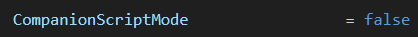
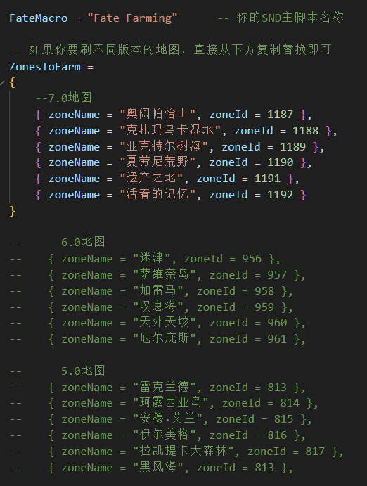
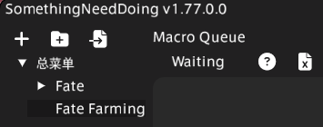
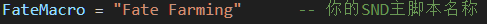

# **※请注意，第一次使用前，一定要调好设置！！！※**
# **※直接启动DLC即可，配置正确的情况下，主脚本会自动启用！！！※**

# Multi_Zone_Farming_CN

## 设置
### Fate_Farming_CN设置
如果您要使用DLC请在Fate_Farming_CN中将此项改为true

### 脚本设置
包含较多设置，设置会随着版本更新而更新，所以更新时记得回来看看！

### SND及脚本内设置
| | |
|--|--|
| SND主脚本命名一定要与DLC内设置一致 |
|  |
|  |