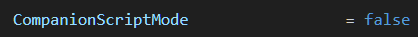
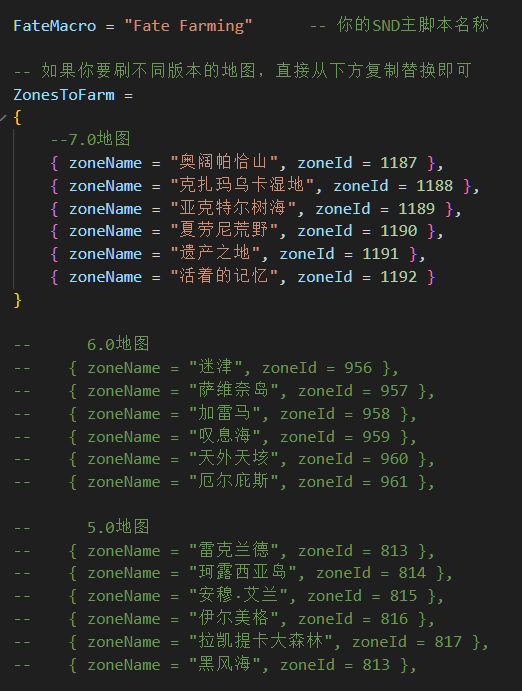
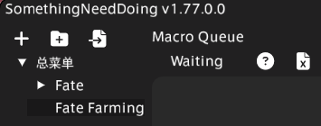
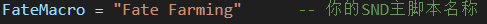

# **※请注意，第一次使用前，一定要调好设置！！！※**
# **※直接启动DLC即可，配置正确的情况下，主脚本会自动启用！！！※**

# Multi_Zone_Farming_CN

## 设置
### Fate_Farming_CN设置
如果您要使用DLC请在Fate_Farming_CN中将此项改为true

### 脚本设置
包含较多设置，设置会随着版本更新而更新，所以更新时记得回来看看！

### SND及脚本内设置
| | |
|--|--|
| SND主脚本命名一定要与DLC内设置一致 |
|  |
|  |

---

# Atma_Farming_CN（古武魂晶）

## 说明
古武魂晶 Farming 配套脚本，需配合 `Fate_Farming_CN.lua` 使用。
本脚本会依次遍历12个魂晶区域，在每个区域刷 FATE 直到获得足够的魂晶，然后传送到下一个区域。

### 设置
- **FateMacro**: Fate Farming主脚本在SND中的名字
- **NumberToFarm**: 每种魂晶需要刷多少个（默认为1）

### 使用方法
1. 确保已安装所有必要插件（Lifestream、vnavmesh、TextAdvance）
2. 在SND中导入主脚本 `Fate_Farming_CN.lua` 和本DLC脚本
3. 在本DLC脚本的设置中填入主脚本的名称
4. 在主脚本设置中开启 `Companion Script Mode`（附属脚本模式）
5. 直接启动本DLC脚本即可