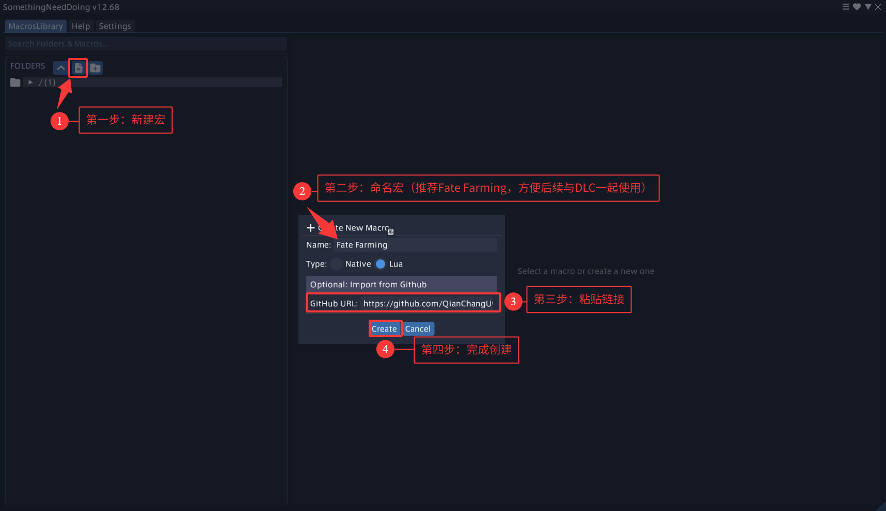
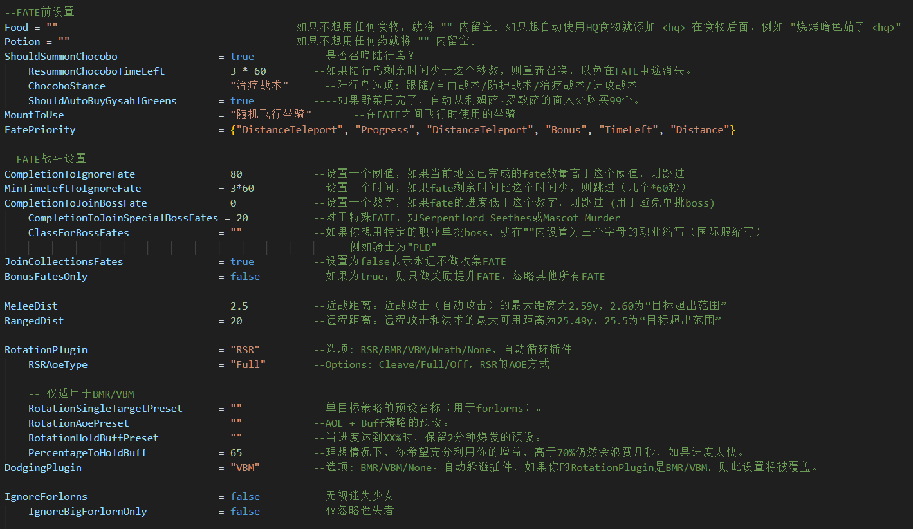
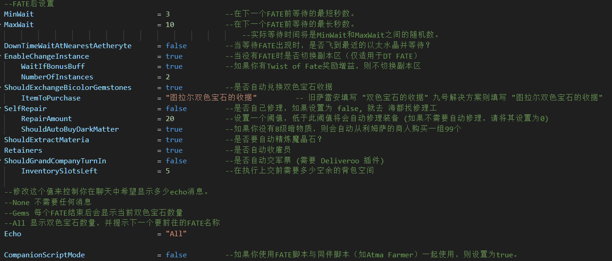
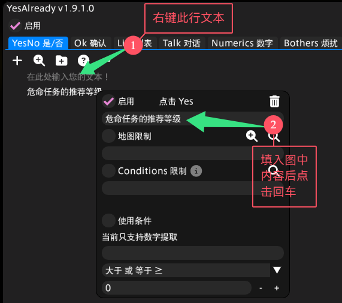

# Fate-Farming-CN
在Fate Farming原本的基础上做了部分调整以适配国服环境
原作者库：https://github.com/pot0to/pot0to-SND-Scripts

Fate Farming的部分功能：
- 双色宝石达到上限时自动购买双色宝石收据（新的旧的都可以）
- Fate优先级系统：剩余进度 > 奖励Fate > 剩余时间最少 > 距离
- 在Fate期间优先攻击迷失者（提升fate奖励的buff怪）
- 可以自动完成所有Fate，包括收集、保护、护送任务
- 死亡后复活并重新回到死亡地点继续Fate
- 当前区域中没有剩余Fate时自动更换线路
- 自动收雇员和提交军票，然后继续打Fate
- 当用完鸟菜和暗物质时自动购买

在原本的基础上做了部分调整以适配国服环境
- 将FATE名称、NPC名、以太水晶名、道具名等进行了翻译
- fate优先级变更
- 将部分等待时间变更
- 可能会有bug，如果出现了bug请创建一个新的issues
- **※仅负责修复本地化错误，不负责逻辑代码bug修复※**

## **※推荐使用VBM+RSR※**

## 注意，一定要将飞行操作类型改成以下类型

## New to Something Need Doing (SND)

## 相关依赖插件安装
### 必要插件
| 插件名 | 作用 | 仓库 |
|-------------|-------------|------|
| Something Need Doing [Expanded Edition] | 主插件 | https://puni.sh/api/repository/croizat |
| VNavmesh | 部署路径和移动 | https://puni.sh/api/repository/veyn |
| RotationSolver Reborn | 选中并攻击 | https://raw.githubusercontent.com/FFXIV-CombatReborn/CombatRebornRepo/main/pluginmaster.json |
| TextAdvance | 与Fate内的NPC互动 | 默认仓库自带 |
| Teleporter | 传送到以太水晶 | 默认仓库自带 |
| Lifestream | 切换副本区 | https://raw.githubusercontent.com/NightmareXIV/MyDalamudPlugins/main/pluginmaster.json |

### 可选插件
| 插件名 | 作用 | 仓库 |
|-------------|---------|------|
| BossMod或BossModReborn | 用AI功能躲避AOE | https://raw.githubusercontent.com/FFXIV-CombatReborn/CombatRebornRepo/main/pluginmaster.json |
| ChatCoordinates | 可以看到下一个fate的目的地是哪里 | 默认仓库自带 |
| AutoRetainer | 收雇员，然后回去继续你的fate | https://love.puni.sh/ment.json |
| Deliveroo | 当雇员带了太多东西填满你的背包时清理到其他地方 | https://plugins.carvel.li/ |

## 设置
### 脚本设置
包含较多设置，设置会随着版本更新而更新，所以更新时记得回来看看！

### YesAlready设置
| | |
|--|--|
|  |
