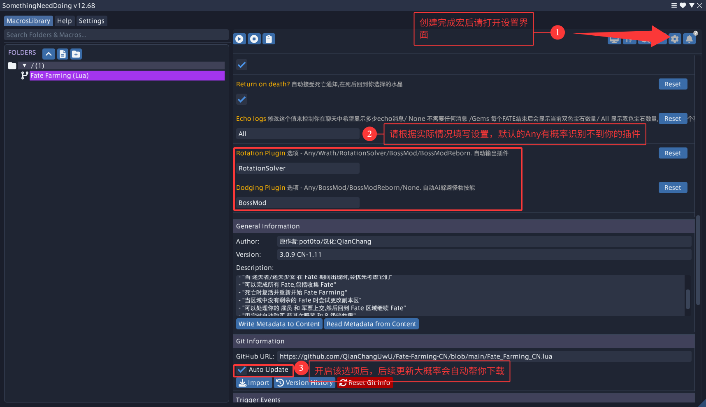

# **※Fate-Farming 已适配最新版 SND，多区域 Fate 已适配※**

# **※请注意，第一次使用前，一定要调好设置！！！※**

# Fate-Farming-CN

|                                                                               |
| ----------------------------------------------------------------------------- |
| Fate Farming 主脚本导入链接                                                   |
| https://github.com/QianChangUwU/Fate-Farming-CN/blob/main/Fate_Farming_CN.lua |

|                                                                                                       |
| ----------------------------------------------------------------------------------------------------- |
| 在 Fate Farming 原本的基础上做了部分调整以适配国服环境                                                |
| 已停止更新---原作者库：https://github.com/pot0to/pot0to-SND-Scripts                                   |
| 持续维护中---现维护库：https://github.com/baanderson40/SND_Scripts/blob/main/Fates/Fate%20Farming.lua |

Fate Farming 的部分功能：

- 双色宝石达到上限时自动购买双色宝石收据（新的旧的都可以）
- Fate 优先级系统：剩余进度 > 奖励 Fate > 剩余时间最少 > 距离
- 在 Fate 期间优先攻击迷失者（提升 fate 奖励的 buff 怪）
- 可以自动完成所有 Fate，包括收集、保护、护送任务
- 死亡后复活并重新回到死亡地点继续 Fate
- 当前区域中没有剩余 Fate 时自动更换线路
- 自动收雇员和提交军票，然后继续打 Fate
- 当用完鸟菜和暗物质时自动购买

在原本的基础上做了部分调整以适配国服环境

- 将 FATE 名称、NPC 名、以太水晶名、道具名等进行了翻译
- fate 优先级变更
- 将部分等待时间变更
- 可能会有 bug，如果出现了 bug 请创建一个新的 issues
- **※仅负责修复本地化错误，不负责逻辑代码 bug 修复※**

## **※推荐使用 VBM+RSR+DR 自动开启危命任务模块※**

# 设置

## 新建脚本 (SND2)

## 脚本设置 **※一定要看※**

## 注意，一定要将飞行操作类型改成以下类型

## 建议开启 DR 此模块，不用再对话 NPC 即可开启 Fate

## 相关依赖插件安装

### 必要插件

| 插件名                                  | 作用                  | 仓库                                                                                         |
| --------------------------------------- | --------------------- | -------------------------------------------------------------------------------------------- |
| Something Need Doing [Expanded Edition] | 主插件                | https://puni.sh/api/repository/croizat                                                       |
| VNavmesh                                | 部署路径和移动        | https://puni.sh/api/repository/veyn                                                          |
| RotationSolver Reborn                   | 选中并攻击            | https://raw.githubusercontent.com/FFXIV-CombatReborn/CombatRebornRepo/main/pluginmaster.json |
| TextAdvance                             | 与 Fate 内的 NPC 互动 | 默认仓库自带                                                                                 |
| Teleporter                              | 传送到以太水晶        | 默认仓库自带                                                                                 |
| Lifestream                              | 切换副本区            | https://raw.githubusercontent.com/NightmareXIV/MyDalamudPlugins/main/pluginmaster.json       |

### 可选插件

| 插件名                   | 作用                                           | 仓库                                                                                         |
| ------------------------ | ---------------------------------------------- | -------------------------------------------------------------------------------------------- |
| BossMod 或 BossModReborn | 用 AI 功能躲避 AOE                             | https://raw.githubusercontent.com/FFXIV-CombatReborn/CombatRebornRepo/main/pluginmaster.json |
| ChatCoordinates          | 可以看到下一个 fate 的目的地是哪里             | 默认仓库自带                                                                                 |
| AutoRetainer             | 收雇员，然后回去继续你的 fate                  | https://love.puni.sh/ment.json                                                               |
| Deliveroo                | 当雇员带了太多东西填满你的背包时清理到其他地方 | https://plugins.carvel.li/                                                                   |
